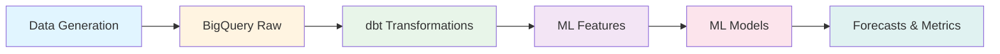

# Autonomous Kitchen Demand Forecasting

End-to-end demand forecasting system for autonomous kitchen operations using Google Cloud Platform, dbt, and Machine Learning.

## Project Overview

demonstrates production-grade data pipeline and ML forecasting capabilities for autonomous food production systems.

## Architecture
```
Raw Data → BigQuery → dbt (Transform) → ML Models → Forecasts
```

## Tech Stack

- **Cloud Platform**: Google Cloud Platform (BigQuery, Vertex AI)
- **Data Transformation**: dbt (data build tool)
- **ML Models**: XGBoost, Prophet
- **Languages**: Python, SQL
- **Orchestration**: Airflow-ready pipeline structure

## Results

- **Dataset**: 164K+ orders across 3 locations over 3 months
- **Best Model**: XGBoost (R² = 0.20, MAE = ~60 orders)
- **Features Engineered**: 30+ features including lag features, rolling averages, external factors

## Project Structure
```
├── generate_data_optimized.py       # Synthetic data generation
├── export_ml_features.py            # Export features from BigQuery
├── kitchen_analytics/               # dbt project
│   ├── models/
│   │   ├── staging/                # Data cleaning
│   │   ├── intermediate/           # Aggregations
│   │   └── ml_features/            # ML-ready features
├── ml_models/
│   ├── prophet_forecast.py         # Time series model
│   ├── xgboost_forecast.py         # Gradient boosting model
│   └── compare_models.py           # Model comparison
└── README.md
```

## Getting Started

### Prerequisites
- Google Cloud Platform account
- Python 3.8+
- dbt-bigquery

### Setup
1. Clone the repository
2. Set up GCP credentials
3. Run data generation
4. Execute dbt models
5. Train ML models

## Key Features

-  Dimensional data modeling (star schema)
-  Feature engineering with lag features and rolling averages
-  Multiple ML model comparison

-  Production-ready data pipeline
-  Comprehensive testing and validation

## Data Architecture

### High-Level Architecture


### Data Flow Layers

| Layer | Tools | Purpose | Output |
|-------|-------|---------|--------|
| **Ingestion** | Python | Generate synthetic data | 164K+ orders |
| **Storage** | BigQuery | Cloud data warehouse | Raw tables |
| **Transform** | dbt | Clean & aggregate | 276 daily records |
| **Features** | SQL + dbt | Feature engineering | 30+ ML features |
| **Model** | Python (XGBoost, Prophet) | Demand forecasting | Predictions |
| **Serve** | CSV, Charts | Business insights | Metrics & viz |

## Orchestration (Airflow-Ready)

This pipeline is designed to be orchestration-ready. The modular structure allows easy integration with Apache Airflow:

**Proposed DAG Structure:**
```python
# Pseudocode for production Airflow DAG
dag = DAG('kitchen_demand_forecast', schedule_interval='@daily')

task1 = PythonOperator(task_id='generate_data')           # Data ingestion
task2 = PythonOperator(task_id='load_to_bigquery')       # Load to warehouse  
task3 = BashOperator(task_id='dbt_run')                  # dbt transformations
task4 = PythonOperator(task_id='export_ml_features')     # Prepare ML data
task5 = PythonOperator(task_id='train_forecast_model')   # Model training
task6 = PythonOperator(task_id='generate_predictions')   # Generate forecasts

task1 >> task2 >> task3 >> task4 >> task5 >> task6
```

**Pipeline Execution Order:**
1. Data Generation/Ingestion
2. BigQuery Load
3. dbt Transformations (staging → intermediate → ML features)
4. Feature Export
5. Model Training
6. Forecast Generation

## Quick Start

Run the entire pipeline:
```bash
./run_pipeline.sh
```

This executes all steps in sequence (orchestration-ready for Airflow).
## Author

**Geraldine Castillo**
[- LinkedIn: (https://www.linkedin.com/in/engrgrldn/)

## License

This project is open source and available under the MIT License.
